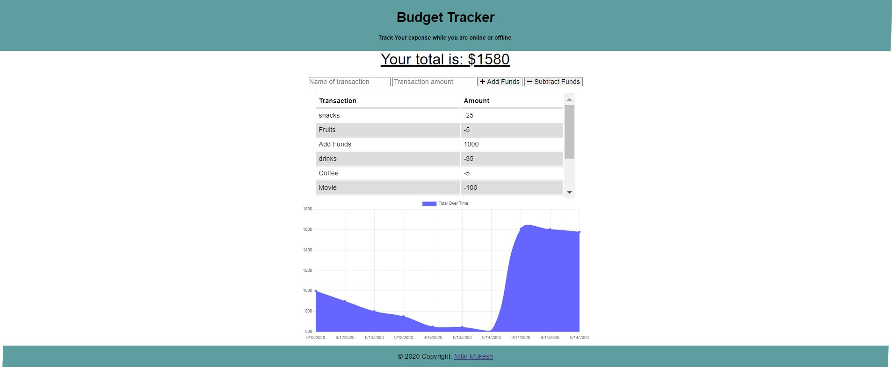

# Budget Tracker

## Description
Budget tracker is a progressive web app which can be used to create and track funds with or without internet and hence it is very handy during travel when internet can be unstable over a period of time. It is built primarily using node.js, mongoDB, webpack and express.
## Table of Contents
* [Installation](#installation)
* [Usage](#usage)
* [License](#license)
* [Contributing](#contributing)
* [Screenshot](#screenshot)
* [URL](#url)
* [Questions](#questions)
## Installation
Please download repository and run npm install and configure mongo database client in server.js. It is currently hosted in heroku as well and URL is given in relevant section.
## Usage
The user will be able to add expenses and deposits to their budget with or without a connection.
### Offline Functionality:
  * Enter deposits offline
  * Enter expenses offline
### When brought back online:
  * Offline entries should be persisted in backend(mongo db).
## Contributing
You are most welcome to contribute. There are following ways to contribute:
1. Please raise a pull request.
2. Please raise a new feature request.
3. Please raise a new issue.
All requests will be reviewed and processed accordingly.
## Screenshot

## URL
https://budget-tracker-nm.herokuapp.com/
## License
This application is covered by [MIT](./LICENSE) license
## Questions
* Please raise a request at [github](https://github.com/nitinmuk)
* For any private question/enquiry, please reach out to my email: nitinmukes@gmail.com
